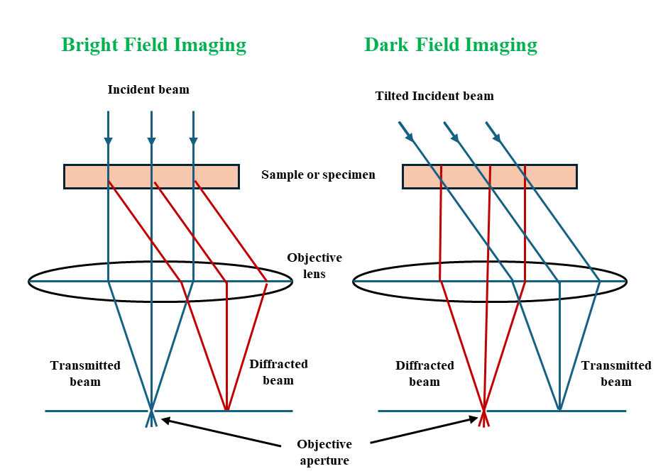
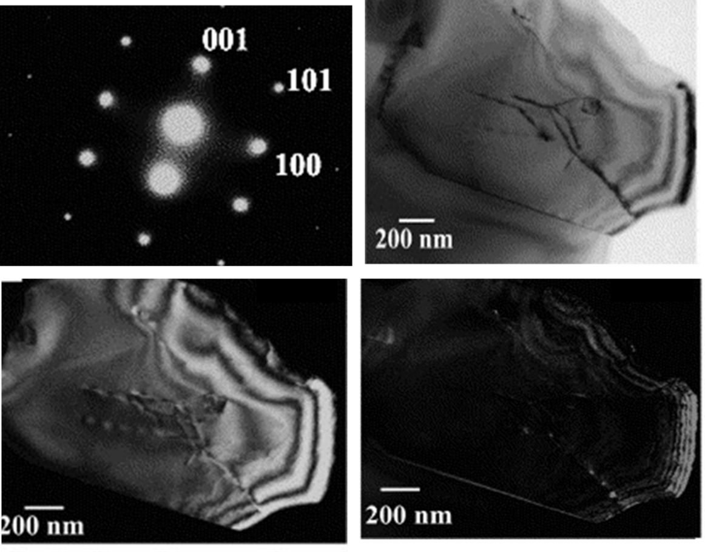
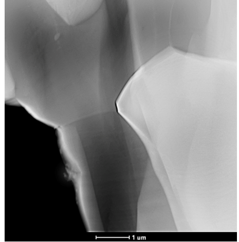
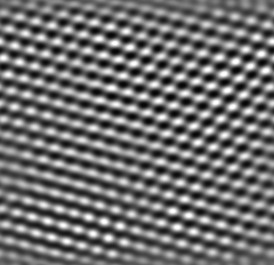
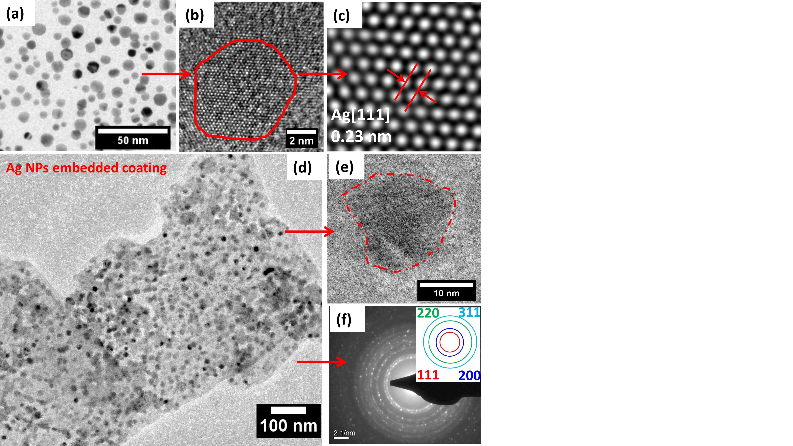

Transmission electron microscopy is a microscopy technique which used a beam of highly accelerated electron to transmit through a very thin sample (< 100 nm) to form an image. The image formed based on the different interactions between the sample and the electron as the beam is transmitted through the sample. If the sample is crystalline, a part the electron beam undergoes diffraction by the atoms and the rest can pass through. By collecting either of the transmitted beam or the diffracted beam imaging in different modes can be done such as Bright field and Dark field mode. In the Figure 2, images corresponding to different modes are represented. In the bright field image (Figure 2b), transmitted electron beam is selected with the aperture, and the scattered electrons are blocked. As the transmitted electron beams are selected, the areas with higher mass appears with dark contrast whereas the areas with lower mass appear with bright contrast. As can be seen from the Figure 1b, which is a selected area diffraction pattern  (SADP), the bright most spot in the middle represents to the transmitted beam, whereas the weak spots are represents the planes in the sample from where the electron beams are diffracted. When the aperture is placed in the transmitted beam by tilting the beam itself, imaging can be done from the regions from where the beams are transmitted through. When, the imaging is done by placing the aperture over the diffracted spots just adjacent to the transmitted beam spot, only the diffracted beam is allowed through the aperture. Hence, the areas where there are no electron scattering and (e.g, the areas around the sample) will be black, while the areas with materials will appear bright (Figure 2c). This is referred to as dark field imaging mode. In the weak beam dark field imaging, the specimen is tilted to excite higher angle diffraction spots, and the aperture is placed on weak diffraction spots (preferably 3rd spot). As, the imaging is done using higher order diffraction spots, the images appear with darker contrast (Figure 2d). 
  
Figure 1. Different modes of imaging in TEM. 
  
Figure 2. (a) Selected area diffraction pattern (SADP) from a TiB2 grain (b) Bright field-TEM image of TiB2 (c) Dark field-TEM image of (a) (d) Weak beam dark field-TEM image of (a) [1].
The size, shape, and crystal lattice of the sample can all be described using TEM dark field and bright field images. Particle mass and crystallinity are the most frequent sources of contrast in images. In comparison to lighter atoms, heavier atoms scatter electrons more intensely. Therefore, the regions containing heavier atoms are brighter in dark field mode and darker in bright field mode. Thus, the bright field mode is more suitable for the understanding the shape or morphology of the samples. As compared to that, the dark field mode is more suitable for imaging crystal defects such as dislocations, twins, stacking faults etc. As, the crystal defects are the main source of diffractions, in the dark field they appear as bright contrast. 
As the beam passes through the sample, electron interactions with the sample may occur either elastically (where the energy of the interacted electron does not change) or inelastically (where the energy of the interacted electron changes). In the High-angle annular dark field (HAADF) imaging, electrons which inelastically scattered to a very high angle are only included. As, this inelastic scattering occurs due to the interactions between the incident electrons and the nuclei of atoms within the sample, HAADF images is also referred to as Z-contrast imaging. The resulting image shows mass- (or Z- ) contrast with higher atomic number regions of the sample appearing brighter than light element regions. HAADF imaging mode is often coupled with elemental mapping where we can also observe the distribution of different elements in different phases present in the sample . 
  
Figure 3 High-angle annular dark field image of NbTiCrZrB2-SiC composite showing different phase contrast where the NbTiCrZrB2¬ phase appears with bright contrast and the SiC phase appears with dark contrast. Correspondingly, the elemental maps shows the distribution of different elements present in different phases.
High-resolution TEM (HR-TEM) is a phase-contrast imaging technique that allows images to be captured with near-atomic resolution, allowing for the study of crystallinity, lattice planes, crystal phases, and defects. The high-resolution transmission electron microscopy (HRTEM) uses both the transmitted and the scattered beams to create an interference image. In tge crystalline materials, specific diffraction angles are present per the Bragg’s law, thus the interference between the electron beams which are diffracted from different planes (which satisfy the Bragg’s condition), generates a periodic pattern as per the sample’s atomic structure. 
  
Figure 4. (a) HRTEM image.  
  

